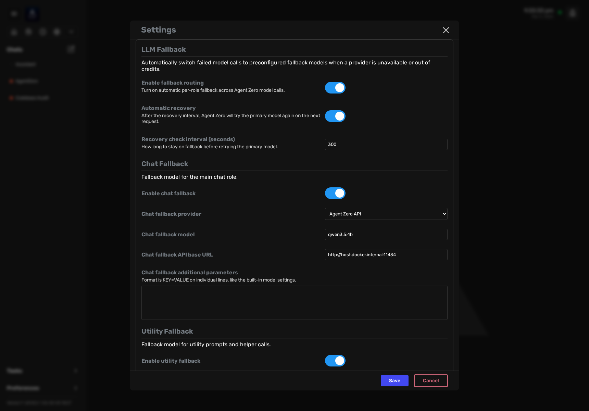
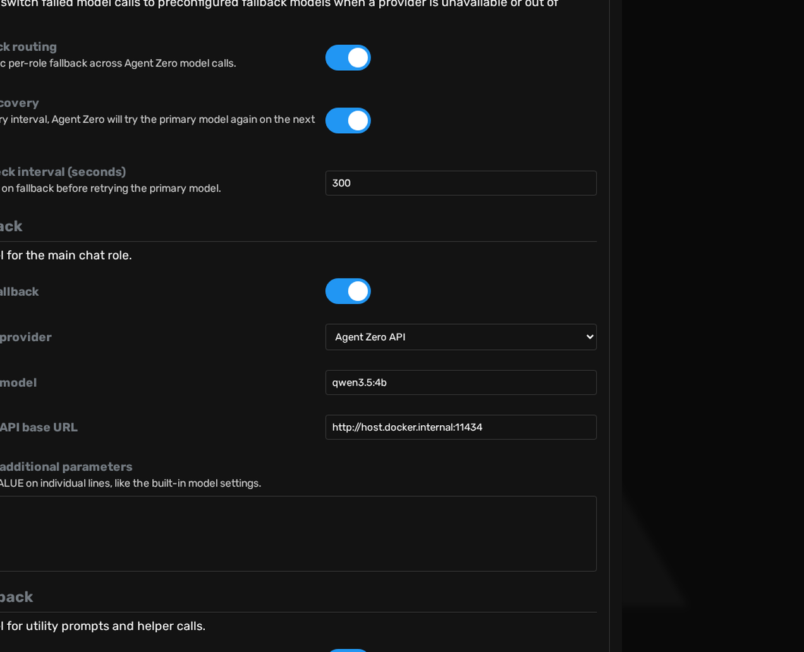

# A0 LLM Fallback

> Automatic per-role LLM failover for Agent Zero with fallback model settings and recovery behavior.

`a0-llmfallback` is a self-contained plugin repository. It does not rely on `curl | bash`, runtime git clone/install scripts, or patching core files in-place.

## What It Does

- Detects broad provider failures and quota-style errors
- Switches the affected role to a configured fallback model
- Retries the failed call once on the fallback model
- Tries the primary model again after the configured recovery interval
- Includes plugin-owned runtime files and plugin metadata in this repository

## UI Preview

LLM Fallback appears as a dedicated settings section in Agent Zero:

Full settings view with the fallback section selected:

Close-up of the fallback configuration panel:

## Install

Use Agent Zero plugin installation flow (Marketplace/index or GitHub plugin source). This repository is the canonical plugin source and contains `plugin.yaml` at root.

For local development, clone the repository and use its runtime files directly.

## Self-Contained Layout

- `plugin.yaml` - marketplace/index metadata
- `runtime/usr/extensions/agent_init/_20_llm_fallback.py` - startup hook
- `runtime/usr/helpers/llm_fallback.py` - fallback manager/runtime logic
- `runtime/webui/components/settings/agent/llm_fallback.html` - plugin-owned settings UI

## Compatibility

Read [compatibility.md](docs/compatibility.md) for runtime assumptions and current limitations.

## Troubleshooting

See [troubleshooting.md](docs/troubleshooting.md).

## License

MIT. See [LICENSE](LICENSE).
